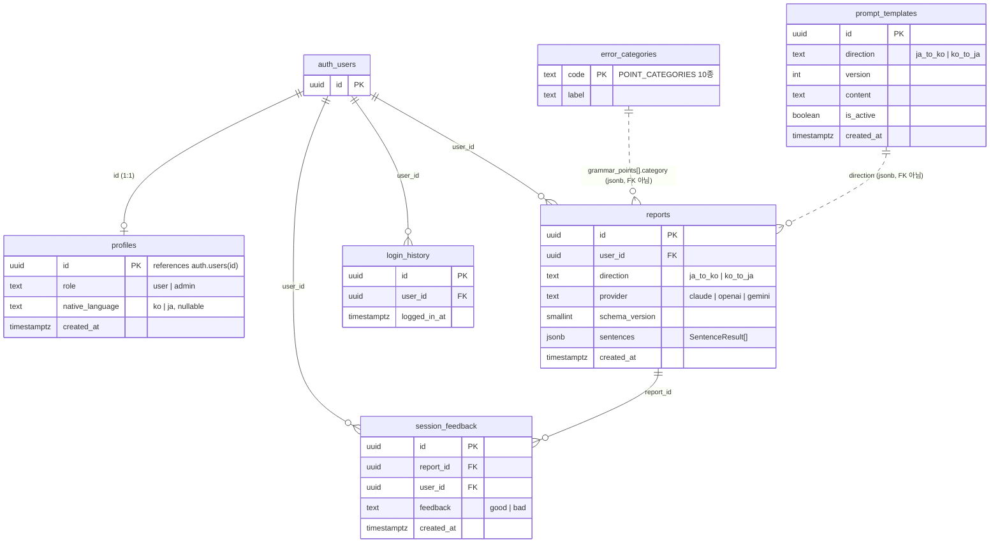

# madi DB 스키마 설계 (draft)

이 문서는 `lib/history.ts`(localStorage) → Supabase DB 마이그레이션을 위한 설계 초안이다.
`[[project-history-uses-db]]` 메모리에서 합의된 방향을 실제 코드 타입(`lib/history.ts`,
`lib/analysis-schema.ts`, `lib/settings.ts`)과 대조해 필드를 확정했다.

**아직 적용되지 않았다.** `schema.sql`은 어디에도 실행되지 않았고, 앱 코드는 여전히
`lib/history.ts`(localStorage) 그대로 동작한다. 이 문서는 다음 단계(실제 마이그레이션 +
데이터 계층 교체)를 위한 설계 자료일 뿐이다.

## 절대 규칙

* **LLM API 키는 어떤 테이블에도 저장하지 않는다.** 지금처럼 브라우저 localStorage에만
  남고, 분석 요청 시에만 서버로 전달되어 그 요청 처리에만 쓰인다 (`.claude/requirements`,
  프로젝트 메모리에서 반복 확인된 절대 규칙).

## ER 다이어그램

## 테이블 명세

### `profiles`

인증 사용자(`auth.users`)당 1행. `auth.users` insert 트리거(`handle_new_user`)로 자동 생성.

| 컬럼 | 타입 | 제약 | 비고 |
|---|---|---|---|
| `id` | `uuid` | PK, FK → `auth.users(id)` ON DELETE CASCADE | |
| `role` | `text` | NOT NULL, DEFAULT `'user'`, CHECK IN (`user`,`admin`) | admin만 `prompt_templates`/`error_categories` 쓰기 가능 |
| `native_language` | `text` | NULL 허용, CHECK IN (`ko`,`ja`) | **설계만 완료, 미배선.** 현재 `/onboarding/language`는 `lib/native-language.ts`로 localStorage(`madi:native-language`)에만 저장한다. DB로 옮길 때 이 컬럼을 채우도록 온보딩 페이지를 수정해야 함 |
| `created_at` | `timestamptz` | NOT NULL, DEFAULT `now()` | |

### `reports`

`HistorySession`(`lib/history.ts`) 1:1 대응. 문장별 결과(`sentences`)는 정규화하지 않고
`TranslationAnalysisReport`(`lib/analysis-schema.ts`) 구조 그대로 JSONB로 저장 — 지금
TS 타입을 그대로 직렬화하는 형태라 앱 쪽 매핑 코드가 거의 필요 없다.

| 컬럼 | 타입 | 제약 | 비고 |
|---|---|---|---|
| `id` | `uuid` | PK, DEFAULT `gen_random_uuid()` | |
| `user_id` | `uuid` | NOT NULL, FK → `auth.users(id)` ON DELETE CASCADE | |
| `direction` | `text` | NOT NULL, CHECK IN (`ja_to_ko`,`ko_to_ja`) | `Direction` |
| `provider` | `text` | NOT NULL, CHECK IN (`claude`,`openai`,`gemini`) | `Provider` (`lib/settings.ts`) — API 키 자체는 저장하지 않음 |
| `schema_version` | `smallint` | NOT NULL, DEFAULT `3` | `HistorySession.schemaVersion`과 동일한 목적 — 리포트 구조가 바뀌면 버전을 올리고 구버전 파싱 분기 |
| `sentences` | `jsonb` | NOT NULL | `SentenceResult[]` — `{ sourceText, userTranslation, report: TranslationAnalysisReport, durationMs? }` |
| `created_at` | `timestamptz` | NOT NULL, DEFAULT `now()` | |

인덱스: `(user_id, created_at DESC)` — 대시보드 최근 기록/잔디그래프.
`(user_id, direction, created_at DESC)` — "이전 세션 대비" 비교(`findPreviousSession`,
`lib/session-summary.ts`)가 같은 방향의 직전 리포트를 찾을 때 사용.

> **알려진 갭:** `design-requirement.md`는 `ko_to_ja` 방향에 TOPIK 등급 배지를 요구하지만,
> 현재 `analysis-schema.ts`의 `difficulty.level`은 방향에 상관없이 JLPT 등급만 사용한다
> (TOPIK 미구현). DB 컬럼은 코드 타입을 그대로 반영했으므로 이 갭도 그대로 옮겨왔다 —
> 스키마가 아니라 분석 로직/프롬프트 쪽에서 먼저 해결해야 할 문제.

### `session_feedback`

리포트에 대한 좋아요/싫어요. **UI 미구현** (`app/history/[id]/page.tsx` 등 어디에도 아직
버튼 없음) — project-summary.md에 명시된 테이블이라 스키마만 미리 마련.

| 컬럼 | 타입 | 제약 | 비고 |
|---|---|---|---|
| `id` | `uuid` | PK, DEFAULT `gen_random_uuid()` | |
| `report_id` | `uuid` | NOT NULL, FK → `reports(id)` ON DELETE CASCADE | |
| `user_id` | `uuid` | NOT NULL, FK → `auth.users(id)` ON DELETE CASCADE | |
| `feedback` | `text` | NOT NULL, CHECK IN (`good`,`bad`) | |
| `created_at` | `timestamptz` | NOT NULL, DEFAULT `now()` | |

`UNIQUE (report_id, user_id)` 추가 — 원안(메모리 초안)에는 없었지만, 리포트당 사용자 1회
피드백만 허용하는 게 자연스러워서 넣음. 불필요하면 마이그레이션 적용 전에 빼도 됨.

### `login_history`

로그인 이력. **채우는 방식 미결정** — project-summary.md는 "Supabase Auth 이벤트 훅에서
기록"이라 했지만, DB 트리거(`auth.sessions`)로 할지 `/auth/callback` 라우트에서 직접
insert할지는 이번 설계에 포함하지 않았다. 테이블/RLS만 정의.

| 컬럼 | 타입 | 제약 | 비고 |
|---|---|---|---|
| `id` | `uuid` | PK, DEFAULT `gen_random_uuid()` | |
| `user_id` | `uuid` | NOT NULL, FK → `auth.users(id)` ON DELETE CASCADE | |
| `logged_in_at` | `timestamptz` | NOT NULL, DEFAULT `now()` | |

### `prompt_templates`

방향별 분석 프롬프트 버전 관리. 관리자만 쓰기, 전체 읽기 가능(활성 템플릿 조회용).

| 컬럼 | 타입 | 제약 | 비고 |
|---|---|---|---|
| `id` | `uuid` | PK, DEFAULT `gen_random_uuid()` | |
| `direction` | `text` | NOT NULL, CHECK IN (`ja_to_ko`,`ko_to_ja`) | |
| `version` | `int` | NOT NULL | |
| `content` | `text` | NOT NULL | |
| `is_active` | `boolean` | NOT NULL, DEFAULT `false` | |
| `created_at` | `timestamptz` | NOT NULL, DEFAULT `now()` | |

`UNIQUE (direction, version)` + 방향당 `is_active = true`는 최대 1개(부분 유니크 인덱스)로
제약해 "활성 템플릿이 2개"인 상태를 DB 레벨에서 막는다.

### `error_categories`

`POINT_CATEGORIES`(`lib/analysis-schema.ts`) 10종을 그대로 시드. 코드가 이미 상수로
고정하고 있으므로 앱이 이 테이블을 조회해서 쓰진 않지만(지금은 `CATEGORY_LABEL` 상수),
관리자 화면에서 라벨을 편집 가능하게 하려면 이 테이블이 필요.

| 컬럼 | 타입 | 제약 | 비고 |
|---|---|---|---|
| `code` | `text` | PK | 예: `조사_오용` |
| `label` | `text` | NOT NULL | 예: `조사 오용` |

## RLS 정책 요약

전 테이블 `ROW LEVEL SECURITY` 활성화.

| 테이블 | select | insert/update | delete |
|---|---|---|---|
| `profiles` | 본인 행만 + **admin 전체** | 본인 행만 (트리거로 생성되지만, 트리거 도입 전 가입한 계정을 위해 `auth/callback`에서 upsert로 보충 — `20260908010000_profiles_insert_policy.sql`) + **admin은 전체 update(role 변경용)** | — |
| `reports` | 본인 것만 + **admin 전체** | 본인 것만 | 본인 것만 |
| `session_feedback` | 본인 것만 | 본인 것만 + `report_id`가 본인 리포트여야 함 | 본인 것만 |
| `login_history` | 본인 것만 + **admin 전체** | 본인 것만 | — |
| `prompt_templates` | 인증 사용자 전체 | admin만 | admin만 |
| `error_categories` | 전체(익명 포함) | admin만 | admin만 |

관리자 판별은 재귀적 RLS 참조를 피하기 위해 `SECURITY DEFINER` 함수 `is_admin()`으로 분리
(`schema.sql` 참고).

**admin 전체 조회/수정 정책 추가** (`20260911000000_admin_read_write_policies.sql`,
`.claude/requirements/admin-requirement.md` 참고) — 관리자 화면(사용자 관리, 사용 현황
통계)을 위해 `profiles`/`reports`/`login_history`에 `is_admin()` 기반 정책을 permissive
정책으로 추가. 기존 본인 전용 정책과 OR로 공존.

## 다음 단계 (이번 세션에서 하지 않음)

1. `supabase init`으로 CLI 프로젝트 초기화, `schema.sql`을 `supabase/migrations/`로 이동
2. 로컬 Supabase(`supabase start`)에 적용해서 검증
3. `lib/history.ts`를 DB 호출로 교체하는 데이터 계층 작업 (지금 UI 재구축 때는 의도적으로 보류함)
4. `native_language`를 온보딩 페이지에서 실제로 DB에 쓰도록 배선
